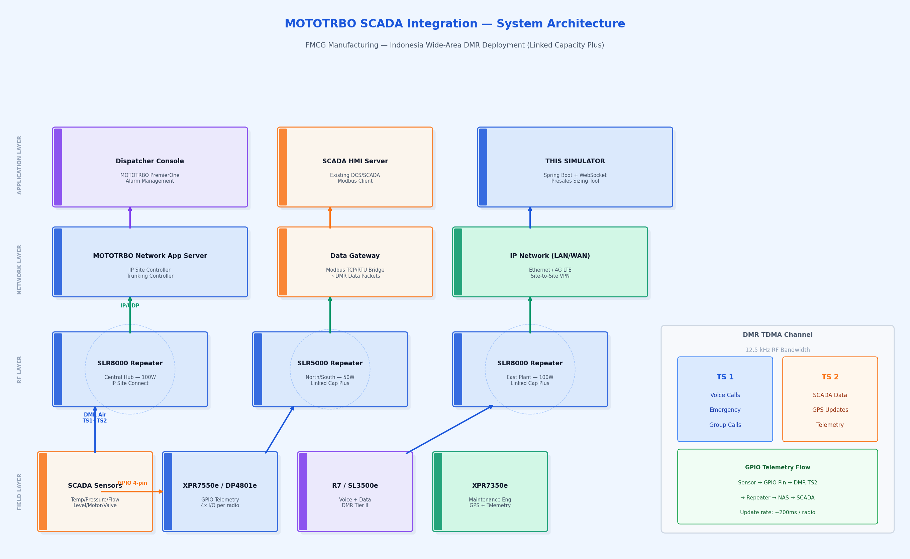
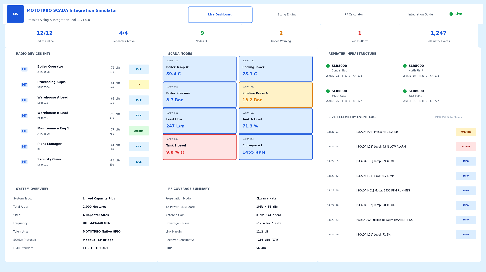
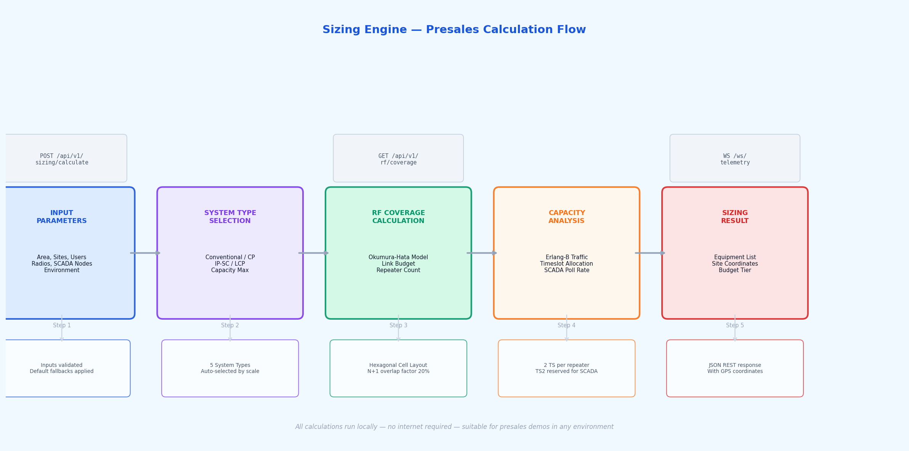

# MOTOTRBO SCADA Integration Simulator
### Presales Sizing & Integration Tool for Motorola Solutions

A comprehensive simulation and presales sizing tool for MOTOTRBO DMR radio integration with industrial SCADA systems. Built for FMCG manufacturing environments in Indonesia with operational areas exceeding 2,000 hectares.

---

## System Architecture



---

## Dashboard Preview



---

## Sizing Engine Flow



---

## Problem Statement

**Client Profile:** FMCG manufacturer, Indonesia, >2,000 Ha operational area across multiple sites.

**Challenge:** Integrate existing SCADA system (PLCs, sensors, HMI) with MOTOTRBO radio infrastructure for:
- Real-time sensor monitoring via field radios
- Alarm propagation from plant sensors to dispatcher
- Two-way control (valve open/close, motor start/stop) via radio
- Wide-area coverage across geographically dispersed factory zones
- Seamless voice + data on single RF infrastructure

**Solution:** MOTOTRBO DMR Tier II/III with Native Telemetry (GPIO) + Data Gateway integration.

---

## Java (Spring Boot) Core

| Criteria | Java | Go | Rust | C++ |
|---|---|---|---|---|
| Enterprise ecosystem | **Excellent** | Good | Limited | Good |
| SCADA/Modbus libraries | **Extensive** | Limited | Limited | Good |
| WebSocket support | **Built-in** | Good | Good | Complex |
| Team adoption (IT dept) | **Highest** | Medium | Low | Medium |
| Spring Security (future) | **Built-in** | Manual | Manual | Manual |
| Long-term maintainability | **Excellent** | Good | Good | Hard |
| Modbus4J, OPC-UA libs | **Available** | Rare | Rare | Available |

**Verdict: Java Spring Boot** is the industry standard for enterprise SCADA middleware. All major SCADA vendors (Wonderware, Ignition, iFIX) have Java integration layers.

---

## Features

### Live Dashboard
- Real-time telemetry stream via WebSocket (updates every 2 seconds)
- 12+ simulated MOTOTRBO radios (XPR7550e, DP4801e, R7, SL3500e)
- 12 SCADA nodes (temperature, pressure, flow, tank level, motor, valve)
- 4 simulated SLR5000/SLR8000 repeaters with VSWR, temperature, channel monitoring
- Live event log showing DMR Timeslot 2 telemetry packets
- KPI cards: radios online, repeater status, SCADA alarms

### Sizing Engine
- Input: area (Ha), sites, users, radios, SCADA nodes, tower height, environment
- Auto-selects optimal system type (Conventional → Capacity Plus → Linked Capacity Plus)
- RF coverage using Okumura-Hata propagation model (industry standard)
- Erlang-B traffic model for channel capacity
- Generates site layout with GPS coordinates
- GPIO point count for telemetry sizing
- Link budget calculation with margin analysis
- Warnings and recommendations
- Budget tier estimation (Entry / Mid / Enterprise)

### RF Calculator
- Standalone link budget tool
- Okumura-Hata model: Urban, Suburban, Open Rural, Industrial Indoor/Outdoor
- Coverage radius and area calculation
- EIRP, received signal level, link margin
- MOTOTRBO receiver sensitivity (-116 dBm for XPR/DP series)
- Includes 15 dB industrial penetration + 3 dB body loss

### Integration Guide
- Three integration paths: GPIO Telemetry, Modbus Bridge, REST API
- DMR Timeslot allocation guide (TS1=Voice, TS2=SCADA)
- MOTOTRBO product reference table
- System type comparison

---

## MOTOTRBO Telemetry Technical Detail

### GPIO Integration (Native MOTOTRBO Telemetry)

The XPR7000e, DP4000e, and R7 series have **4 GPIO pins** per radio, configurable as:
- Digital Input (read sensor state: alarm on/off, valve position, motor running)
- Digital Output (control relay: start motor, open valve, activate beacon)
- Analog Input (0-5V or 4-20mA via IOBOARD accessory)

**Data Transport:**
```
Field Sensor ──GPIO Pin──► XPR7550e ──DMR TS2──► SLR8000 ──IP──► NAS ──► Dispatcher Console
                                    (100ms packet)
```

**Update rate:** ~200ms per radio (minimum), round-robin for multiple radios

**Capacity:** With 12 radios, effective SCADA update rate = 200ms × 12 = 2.4 seconds per complete cycle

### Modbus TCP Bridge (via MOTOTRBO Data Gateway)

For existing SCADA systems with Modbus RTU/TCP:
```
SCADA Server ──Modbus TCP──► Data Gateway ──DMR Data──► Field Radio ──Modbus RTU──► PLC
              (Poll request)  (IP:UDP:50000)              (Serial RS485)
```

- Gateway acts as Modbus slave to SCADA and Modbus master to field devices via radio
- Supports up to 16 Modbus slave devices per gateway
- Latency: ~500ms round-trip (Modbus request → DMR → PLC → DMR → SCADA response)

### System Types

| System | Sites | Users | Use Case |
|---|---|---|---|
| MOTOTRBO Conventional | 1 | ≤30 | Small single-plant |
| Capacity Plus | 1 | ≤500 | Single-site trunking |
| IP Site Connect | 2-12 | ≤200 | Multi-site linked |
| **Linked Capacity Plus** | **2-12** | **≤1000+** | **Recommended for client** |
| Capacity Max | Unlimited | Enterprise | TETRA-equivalent |

---

## Quick Start

### Prerequisites
- Java 17+
- Maven 3.8+
- No database setup required (H2 in-memory)

### Run

```bash
git clone https://github.com/palmacitra/scada_int-mototrbo
cd scada_int-mototrbo
mvn spring-boot:run
```

Open browser: **http://localhost:8080**

### API Endpoints

```bash
# Quick sizing calculation
GET /api/v1/sizing/quick?areaHa=2000&sites=4&users=150&radios=150&scadaNodes=24

# Full sizing (POST with JSON body)
POST /api/v1/sizing/calculate
Content-Type: application/json
{
  "totalAreaHa": 2000,
  "numSites": 4,
  "numUsers": 150,
  "numRadios": 150,
  "numScadaNodes": 24,
  "antennaTowerHeightM": 25,
  "isIndoor": false,
  "radioModel": "XPR7550e",
  "repeaterModel": "SLR8000"
}

# RF Coverage calculation
GET /api/v1/rf/coverage?txPowerW=50&antennaGainDbi=8&towerHeightM=25&frequencyMhz=443&environment=INDUSTRIAL_OUTDOOR

# Live data
GET /api/v1/radios
GET /api/v1/scada/nodes
GET /api/v1/repeaters
GET /api/v1/telemetry/events?limit=50

# WebSocket (real-time)
ws://localhost:8080/ws/telemetry

# H2 Database Console
http://localhost:8080/h2-console
```

---

## Project Structure

```
mototrbo-scada-simulator/
├── src/
│   └── main/
│       ├── java/com/motorola/scada/
│       │   ├── MototrboScadaApplication.java   # Spring Boot main
│       │   ├── config/
│       │   │   └── WebSocketConfig.java         # WebSocket configuration
│       │   ├── controller/
│       │   │   └── ApiController.java           # REST API endpoints
│       │   ├── model/
│       │   │   ├── RadioDevice.java             # Radio HT model (XPR, DP, R7, SL)
│       │   │   ├── Repeater.java               # SLR5000/8000 repeater model
│       │   │   ├── ScadaNode.java              # SCADA sensor/actuator model
│       │   │   ├── TelemetryEvent.java         # Telemetry event history
│       │   │   └── SizingResult.java           # Sizing calculation output
│       │   ├── service/
│       │   │   ├── RfPropagationService.java   # Okumura-Hata RF calculations
│       │   │   ├── SizingEngineService.java    # Presales sizing engine
│       │   │   └── ScadaTelemetrySimulator.java # Live data simulation
│       │   └── websocket/
│       │       └── TelemetryWebSocketHandler.java # Real-time WS push
│       └── resources/
│           ├── static/
│           │   └── index.html                  # Single-page dashboard UI
│           └── application.properties          # Spring Boot configuration
├── docs/
│   ├── architecture-diagram.png               # System architecture
│   ├── ui-dashboard-preview.png              # UI preview
│   └── sizing-engine-flow.png               # Sizing engine flow
├── generate_diagrams.py                       # Diagram generation script
├── pom.xml                                    # Maven dependencies
└── README.md
```

---

## RF Propagation Model

Uses **Okumura-Hata** model — industry standard for VHF/UHF land mobile radio planning.

**Formula (Urban Base):**
```
Lu = 69.55 + 26.16·log(f) - 13.82·log(hte) - a(hre) + [44.9 - 6.55·log(hte)]·log(d)
```

**Environment Corrections applied:**
| Environment | Correction |
|---|---|
| Urban | 0 dB (base) |
| Suburban | -2·[log(f/28)]² - 5.4 dB |
| Open Rural | -4.78·[log(f)]² + 18.33·log(f) - 40.94 dB |
| Industrial Outdoor | +5 dB |
| **Industrial Indoor** | **+20 dB (heavy building penetration)** |

**Link Budget components included:**
- Body loss: 3 dB
- Indoor penetration: 15 dB
- Minimum margin: 8 dB
- Receiver sensitivity: -116 dBm (XPR7000e/DP4000e)

---

## Sizing Example Output

**Input:** 2000 Ha, 4 sites, 150 users, 24 SCADA nodes, SLR8000 repeaters, 25m towers

```json
{
  "systemType": "LINKED_CAPACITY_PLUS",
  "recommendedRepeaters": 4,
  "totalCoverageAreaHa": 1920,
  "coverageEfficiencyPercent": 96.0,
  "timeslotsAvailable": 8,
  "gpioPointsAvailable": 600,
  "maxTelemetryUpdateRateMs": 200,
  "telemetryProtocol": "MOTOTRBO Native Telemetry (GPIO) + MOTOTRBO Data Gateway",
  "estimatedBudgetTier": "ENTERPRISE",
  "linkMarginDb": 11.2,
  "propagationModel": "Okumura-Hata (Industrial)"
}
```

---

## Future Features (Roadmap)

- [ ] Interactive map with repeater coverage circles (Leaflet.js)
- [ ] MOTOTRBO Capacity Max (Tier III) system type
- [ ] OPC-UA SCADA protocol bridge simulation
- [ ] Multi-site RF interference analysis
- [ ] PDF report generation for customer presentation
- [ ] Real Modbus TCP server for integration with actual SCADA tools
- [ ] RSSI heatmap visualization
- [ ] Emergency call simulation (MOTOTRBO Emergency feature)
- [ ] Antenna pattern import (antenna manufacturer .pat files)
- [ ] Export to Motorola CPQ (quoting system) format

---

## Technical References

- ETSI TS 102 361-1: Digital Mobile Radio (DMR) Air Interface Protocol
- Okumura, T. et al. (1968): Field Strength and Its Variability in VHF and UHF Land Mobile Radio Service
- Hata, M. (1980): Empirical Formula for Propagation Loss in Land Mobile Radio Services
- Motorola Solutions: MOTOTRBO System Planner (internal reference)
- Motorola Solutions: SLR8000 Technical Specifications
- Motorola Solutions: XPR7000e Series Specifications
- ITU-R P.1546: Method for point-to-area predictions for terrestrial services

---

## Disclaimer

This simulator is an **presales tool** for sizing and demonstration purposes. RF calculations are estimates based on industry-standard propagation models. Actual site surveys, RF drive tests, and professional RF engineering are required for production deployments. Equipment specifications reference publicly available Motorola Solutions datasheets.

---

*Motorola Solutions MOTOTRBO Presales Engineers — Indonesia Region*
